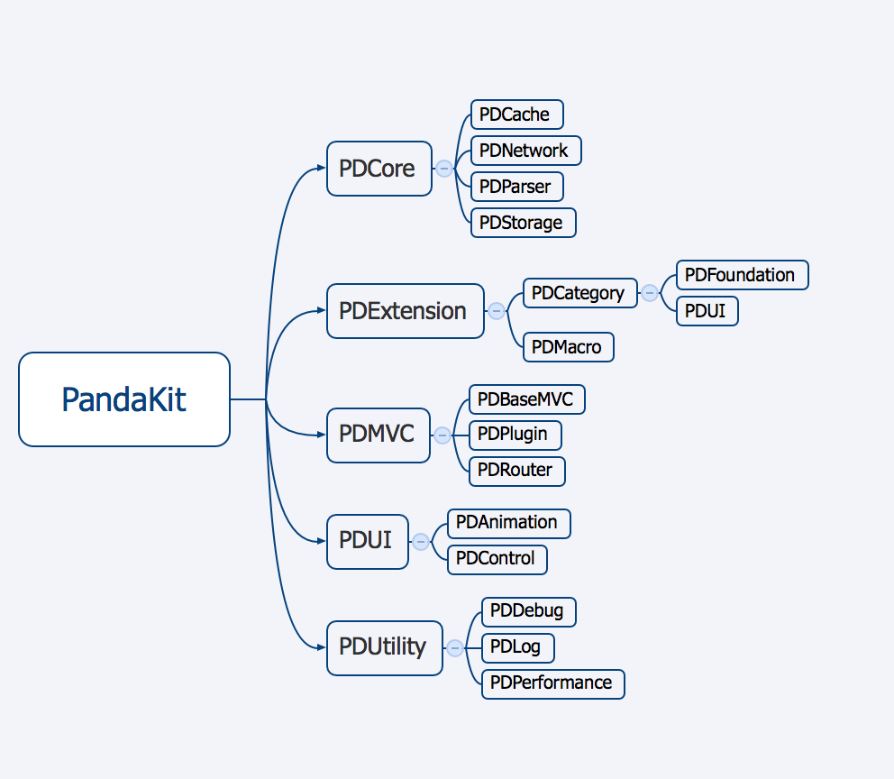

# PandaKit
##### 快速开发框架框架
---
	我能用三天写出市面上绝大多数的应用。
	——老郭为人名服务
###简介与适用
* 这是一个业余项目，目前不适用任何跟 **发布** 有关的项目。
* 本项目提供了大量的工具类，以保证开发速度。与此同时有一定的学习曲线，需要十分熟悉整套工具库。
* 不以 **让别人愉快阅读** 为目的，顺手为之的函数中可能会包含各种难以看懂但简洁的语法。
* 综合来说就是到处抄抄以满足 pod 一个库可以迅速完成一整个应用。

###功能描述与使用范例
这里将会有各种实例

###框架结构

###功能列表
 |  |  |  |  |  |)
Category - Foundation

| 模块名称 | 编码 | 日志 | 单元测试 | 例子 | 优化 |
| ------- |:---:|:---:|:-------:|:---:|:----:|
| NSArray | √ |  |  |  |  |
| NSDictionary |  |  |  |  |  |
| NSIndexSet |  |  |  |  |  |
| NSInvocation |  |  |  |  |  |
| NSNumber |  |  |  |  |  |
| NSObject |  |  |  |  |  |
| NSSet |  |  |  |  |  |
| NSTimer |  |  |  |  |  |
| NSObject |  |  |  |  |  |

###声明
* 框架内部分代码引用自 BlockKit、XYQuick、BeeFramework、Samurai、Masonry 等。
* 具体引用部分详见文件头部的说明。